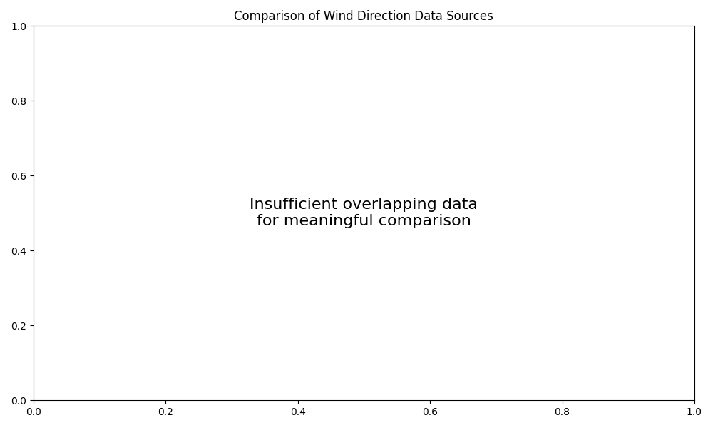

# Wind Direction Explorer

This interactive web application allows you to explore historical wind direction patterns for any location worldwide. Leveraging data from the Open-Meteo API, it provides in-depth analysis of easterly and westerly wind patterns over the past decade.



## Features

- **Interactive Map Selection**: Click anywhere on the map to analyze wind patterns for that location
- **10-Year Historical Data**: View wind direction trends from the past decade
- **Comprehensive Analysis**: 
  - Monthly and yearly westerly wind percentages
  - Seasonal wind pattern visualization
  - Identification of longest wind direction streaks

## Running the Application Locally

### Option 1: Direct Streamlit Execution

1. Install the required dependencies:
   ```bash
   pip install -r ../requirements.txt
   ```

2. Run the Streamlit app:
   ```bash
   streamlit run wind_direction_app.py
   ```

3. The application will open in your default web browser at http://localhost:8501

### Option 2: Using Docker (Local Build)

1. Navigate to the project root directory:
   ```bash
   cd ..
   ```

2. Build the Docker image:
   ```bash
   docker build -t wind-direction-app .
   ```

3. Run the Docker container:
   ```bash
   docker run -p 8501:8501 wind-direction-app
   ```

4. Access the application at http://localhost:8501

### Option 3: Using Docker Image from GitHub Container Registry

Pull and run the pre-built image directly from GitHub Container Registry:

```bash
# Pull the latest image
docker pull ghcr.io/emanuelef/historical-wind-direction/wind-direction-app:main

# Run the container
docker run -p 8501:8501 ghcr.io/emanuelef/historical-wind-direction/wind-direction-app:main
```

Access the application at http://localhost:8501

## How to Use

1. **Select a Location**: Click on any point on the map to choose a location for analysis
2. **View Analysis**: The application will fetch and process 10 years of wind data for the selected location
3. **Explore Different Tabs**:
   - **Westerly Wind Percentage**: View a heatmap of westerly wind percentages by month and year
   - **E/W Monthly Stats**: Explore the monthly distribution of easterly vs. westerly winds
   - **Longest Wind Streaks**: See the longest consecutive periods of consistent wind directions

## Data Source

All wind data is retrieved from the [Open-Meteo Historical Weather API](https://open-meteo.com/en/docs/historical-weather-api), which provides hourly historical weather data based on reanalysis models.
